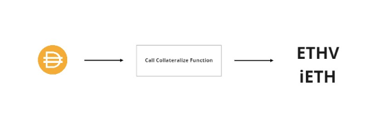
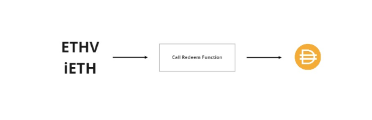
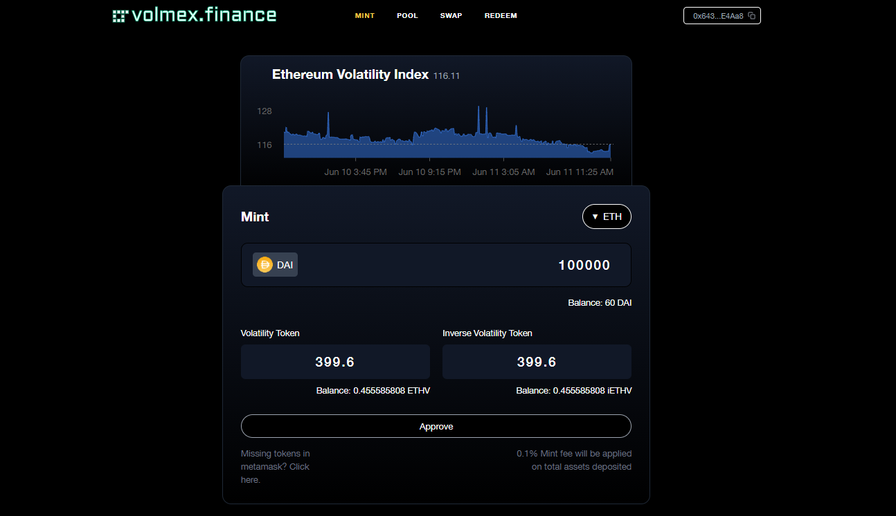

# ارائه دهندگان نقدینگی

## مینت توکن های نوسانات                                                         &#x20;

سپرده‌گذاری وثیقه به توکن‌های نوسان ضرابخانه، ارائه‌دهندگان نقدینگی جزء ضروری پروتکل هستند.                         &#x20;

ارائه دهندگان نقدینگی volmex.finance وثیقه استیبل کوین (DAI در زمان راه اندازی و به زودی انواع دیگر وثیقه) سپرده گذاری می کنند و مقادیر متناسبی از توکن های شاخص نوسان و توکن های شاخص نوسان معکوس را برش می دهند.                                                                                                                                                   &#x20;

توکن شاخص نوسانات و توکن شاخص نوسان معکوس دو بخش از یک کل هستند که با هم می‌توانند برای وثیقه استیبل کوین متناسب مورد نیاز برای ضرب (با کمتر از 0.3 درصد کارمزد بازخرید) بازخرید شوند. 250 ضرابخانه DAI \~ 1 توکن شاخص نوسان (از لحاظ فنی 0.999، کمتر از هزینه برش) و \~1 توکن نوسان معکوس. این نسبت برای هر دو بازار بی ثباتی BTC و ETH روی 250 تنظیم شده است.                                                                                      &#x20;

نشانه شاخص نوسان طولانی (به عنوان مثال ETHV) قیمت شاخص نوسان را دنبال می کند. اگر شاخص نوسان اتریوم حدود 110% قیمت داشته باشد، توکن شاخص بر اساس تهدید تسویه حساب جهانی، باید حدود 110 دلار معامله شود. برعکس، توکن شاخص نوسان معکوس (به عنوان مثال iETHV) باید حدود 140 دلار معامله شود. ممکن است بین قیمت توکن نوسانات و شاخص مرجع انحراف وجود داشته باشد.                                                                             &#x20;

&#x20;                                                                                                                                                                      &#x20;

&#x20;      مثال:                                                                                                                                                                                   چاد 250 DAI سپرده گذاری می کند و توکن 0.999 Ethereum Volatility Index \[ETHV] و 0.999 Inverse                     Volalitility Index Ethereum \[iETHV] (پس از 0.1٪ کارمزد ضرابخانه). در این زمان، شاخص نوسان اتریوم حدود              140٪ قیمت دارد. چاد توکن‌های شاخص نوسان اتریوم \[ETHV] و توکن‌های شاخص نوسان معکوس \[iETHV] را                          دراختیار Uniswap یا دیگر استخرهای AMM مربوطه قرار می‌دهد تا کارمزد معاملات را دریافت کند. چاد می تواند              توکن0.999 Ethereum Volatility Index \[ETHV] و 0.999 Inverse Volatility Index \[iETHV] خود را با هم برای     249.25 DAI بازخرید کند.                                                                                                                                           &#x20;

## بازخرید                                                                                               &#x20;

ارائه‌دهندگان نقدینگی همیشه می‌توانند مقادیر مساوی از توکن‌های نوسان (به عنوان مثال 1 ETHV و 1 iETHV) را برای وثیقه استیبل کوین متناسب بازخرید کنند.                                                                                                   &#x20;

## حداقل ها                                                                                       &#x20;

حداقل سپرده پروتکل 25 DAI یا USDC است.                                                                                                        &#x20;

&#x20;                                                                                                         &#x20;

## تامین نقدینگی                                                                              &#x20;

توکن‌های نوسانات ضرب شده را می‌توان به استخرهای Uniswap (به عنوان مثال ETHV / USDC یا iETHV / USDC) برای دریافت هزینه‌های معاملاتی ارائه کرد. نقدینگی در بین سه مجموعه اصلی نقدینگی برای هر شاخص متمرکز است.                                                                                                                                                   &#x20;

## وثیقه پشتیبانی شده                                                                 &#x20;

در حال حاضر، DAI و USDC به عنوان وثیقه پشتیبانی می شوند.                                                                                 &#x20;

&#x20;توکن‌های نوسانی که با DAI ضرب شده‌اند، با توکن‌های نوسانی که با USDC ضرب شده‌اند، قابل تعویض هستند. بازخریدکنندگان می توانند انتخاب کنند که در هنگام بازخرید کدام دارایی را می خواهند بازخرید کنند. برنامه وب              Volmex نشان می دهد که چه مقدار USDC و DAI برای بازخرید در قراردادهای Volmex در دسترس است.                                                                                                    &#x20;

## دستور العمل ها                                                                             &#x20;

1: برای شروع از برنامه ی volmex برای واریز وثیقه و توکن ها ی نوسانات استفاده کنید.کیف پول خود را متصل کنید ، مقدار usdc/dai  را برای تایید وارد کنید و مینت کنید                                                                                               &#x20;

2: تامین نقدیندگی به استخر های مربوطه در زیر.                                                                                              &#x20;

بازارهای توکن نوسان برای تامین نقدینگی: [https://volmex.finance/pool](https://volmex.finance/pool/)/                                                          &#x20;
